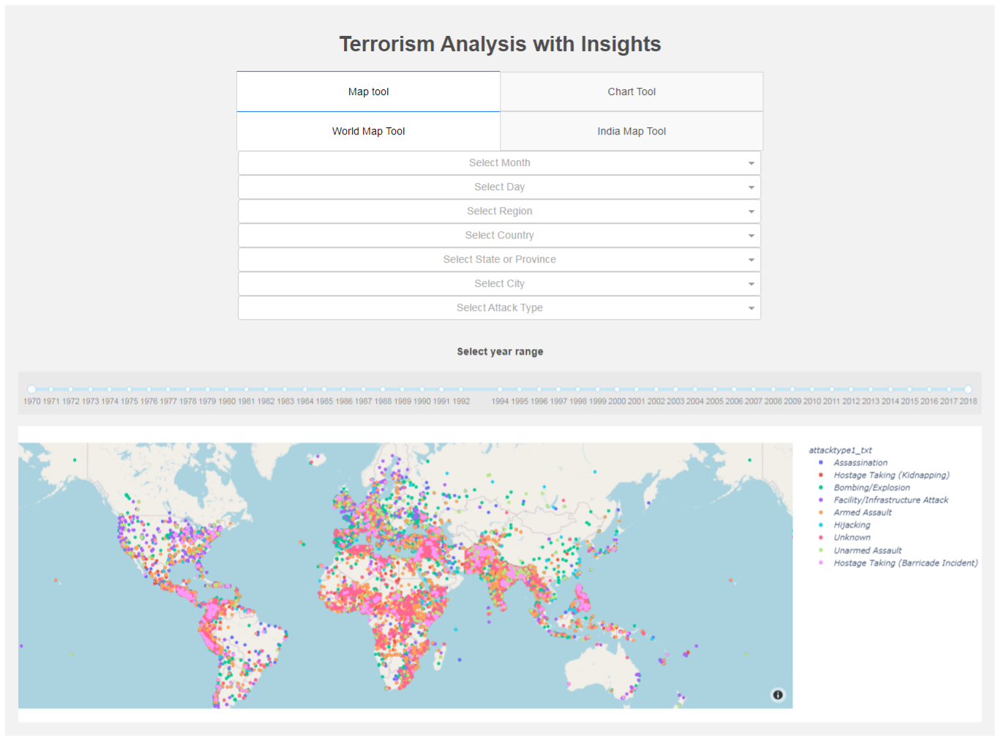
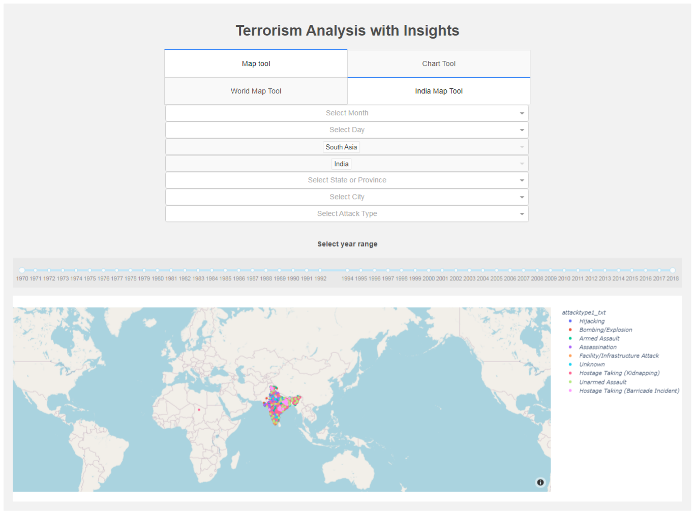
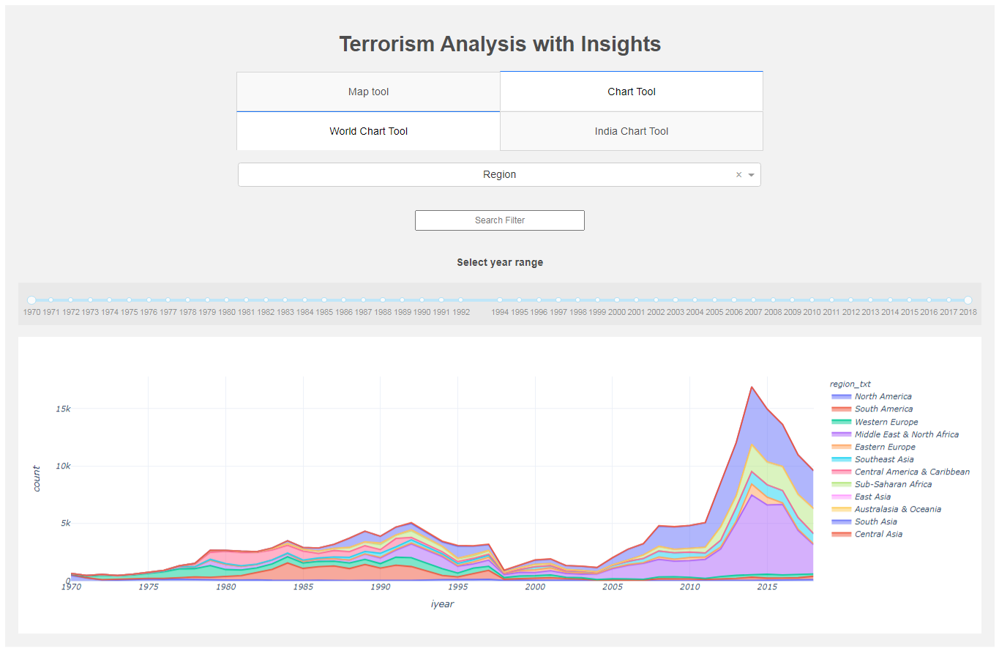
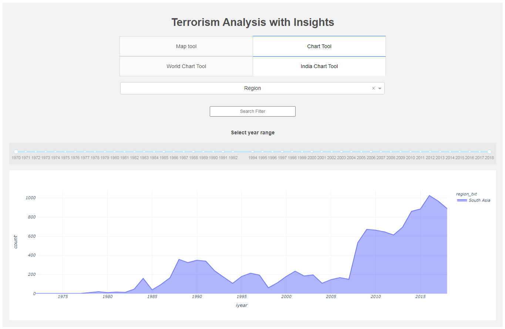

# Terrorism Analysis and Finding Insights
A visual summary of information to make it easier to identify patterns and trends.

## Project Work

### Problem Statement : To design a Dashboard for Analysis and Forecasting

### Solution Approach: Reduced 80MB file to 31MB file, 190,000 data with 23 columns

### WireFrame of the Web Application
* Map Tool
* Chart Tool

### Screenshots

### Tech Stack
* Frontend: Dash, CSS3
* Backend: Python

#### Project created under the guidance of Dr. Sylvester Fernandes | Forsk Technologies Private Limited
